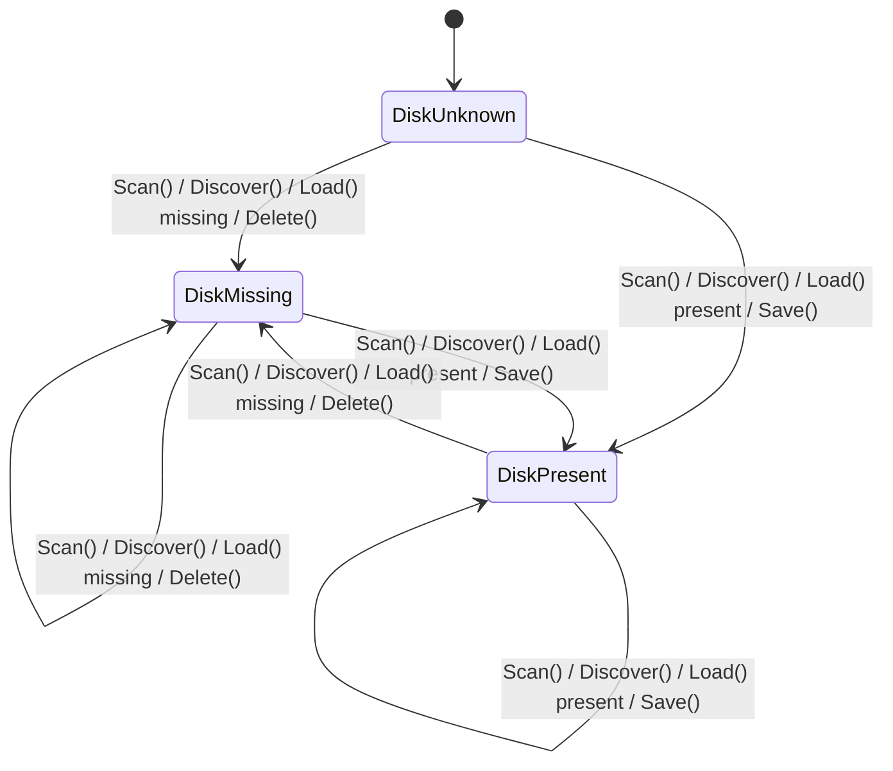
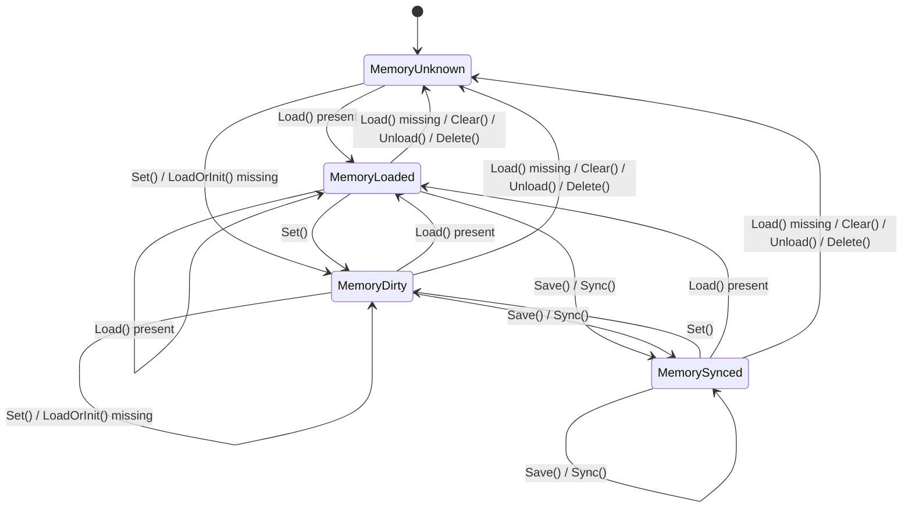

# States usage

Conduit's typed files track two independent state axes:

- disk state: what the file layer currently knows about the filesystem
- memory state: what the typed file currently knows about in-memory content

This applies to `Format[T]` and therefore to `JSONFile[T]`, `YAMLFile[T]`, and `TOMLFile[T]`.

The important rule is that these axes are deliberately separate. A memory operation does not automatically rewrite disk knowledge, and a disk observation does not automatically replace in-memory content.

## Why the model is split

Conduit avoids implicit reconciliation.

That means a typed file can legitimately be in states like:

- disk present, memory unknown: the file exists, but you have not loaded it
- disk present, memory dirty: you know the file exists, but your in-memory value has diverged from disk
- disk missing, memory dirty: you have prepared a value in memory, but have not written it yet

Those combinations are expected. They are what make `Load`, `Discover`, `Scan`, `Set`, and `Sync` distinct operations instead of one hidden merge process.

## Disk state

Disk state answers one question: what do we currently know about the file on disk?

Values:

- `DiskUnknown`: no observation has been made yet, or composition reset the state
- `DiskMissing`: the file was checked and was not present
- `DiskPresent`: the file was checked and was present

How disk state changes:

- `Compose` or `ComposePath` resets it to `DiskUnknown`
- `Scan` sets it to `DiskMissing` or `DiskPresent`
- `Discover` sets it to `DiskMissing` or `DiskPresent`
- `Load` sets it to `DiskMissing` or `DiskPresent`
- `Save` and successful `Sync` set it to `DiskPresent`
- `Delete` sets it to `DiskMissing`
- `Clear` and `Unload` do not change it
- `Set` does not change it



## Memory state

Memory state answers a different question: what do we currently know about the in-memory value?

Values:

- `MemoryUnknown`: no meaningful in-memory content is currently loaded
- `MemoryLoaded`: content was loaded from disk
- `MemorySynced`: content was written to disk by Conduit
- `MemoryDirty`: content exists in memory and has been set or changed since the last load or sync

How memory state changes:

- `Compose` or `ComposePath` resets it to `MemoryUnknown`
- `Load` sets it to `MemoryLoaded` when the file exists
- `Load` sets it to `MemoryUnknown` when the file is missing
- `LoadOrInit` sets it to `MemoryDirty` only when the file is missing and the default is installed in memory
- `Set` sets it to `MemoryDirty`
- `Save` and successful `Sync` set it to `MemorySynced`
- `Clear`, `Unload`, and `Delete` set it to `MemoryUnknown`
- `Discover` does not change it
- `Scan` does not change it
- `Sync` without content is a no-op, so state stays unchanged
- `Sync` with excluded policy is also a no-op, so state stays unchanged



## Operation summary

The table below focuses on `Format[T]` behavior.

| Operation                 | Disk state effect   | Memory state effect   | Content effect                  |
|---------------------------|---------------------|-----------------------|---------------------------------|
| `Compose` / `ComposePath` | reset to unknown    | reset to unknown      | clears content                  |
| `Discover()` present      | set to present      | unchanged             | unchanged                       |
| `Discover()` missing      | set to missing      | unchanged             | unchanged                       |
| `Scan()` present          | set to present      | unchanged             | unchanged                       |
| `Scan()` missing          | set to missing      | unchanged             | unchanged                       |
| `Load()` present          | set to present      | set to loaded         | replace content from disk       |
| `Load()` missing          | set to missing      | set to unknown        | clear content                   |
| `LoadOrInit()` present    | set to present      | set to loaded         | replace content from disk       |
| `LoadOrInit()` missing    | set to missing      | set to dirty          | install default value in memory |
| `Set(value)`              | unchanged           | set to dirty          | replace content in memory       |
| `Save()`                  | set to present      | set to synced         | write content to disk           |
| `Sync()` with content     | set to present      | set to synced         | write content to disk           |
| `Sync()` without content  | unchanged           | unchanged             | no-op                           |
| `Clear()`                 | unchanged           | set to unknown        | clear content                   |
| `Unload()`                | unchanged           | set to unknown        | clear content                   |
| `Delete()`                | set to missing      | set to unknown        | delete file and clear content   |

## Important behaviors

### `Scan` preserves memory

`Scan` is observational. It updates only disk knowledge.

If you already have a dirty in-memory value, `Scan` does not overwrite it:

```go
svc.Config.Set(ServiceConfig{Name: "preview", Port: 3000})
_, _ = svc.Config.Scan()
```

After this:

- disk state reflects whether the file exists
- memory state is still dirty
- the in-memory value is still `preview:3000`

### `Discover` preserves memory too

For a typed file, `Discover` has the same state effect as `Scan`.

The difference appears in deep traversal:

- `DiscoverDeep` discovers slot-backed children from disk before recursing
- `ScanDeep` only observes items that are already cached in memory

### `Load` is authoritative for memory

`Load` replaces in-memory content with what is on disk when the file exists.

If the file is missing, `Load` clears memory entirely:

```go
loaded, _ := svc.Config.Load()
```

After a missing load:

- `loaded == false`
- disk state is missing
- memory state is unknown
- cached content is gone

### `LoadOrInit` keeps disk and memory separate

`LoadOrInit(defaultValue)` is not a write.

When the file is missing, it:

1. observes disk as missing
2. installs the default into memory
3. marks memory dirty

That means the resulting combination is intentionally:

- disk missing
- memory dirty

The default is only written if you later call `Save`, `Sync`, or `SyncDeep`.

### `Save` and `Sync` are not identical

Both successful operations end in:

- disk present
- memory synced

The difference is precondition behavior:

- `Save` returns an error when no content is loaded
- `Sync` silently does nothing when no content is loaded
- `Sync` also silently does nothing when the current memory state is excluded by `Context.SyncPolicy`

### `Clear` and `Unload` only affect memory

Both operations clear cached content and reset memory state to unknown.

They do not erase the last known disk observation. If the file was previously known to be present, disk state stays present.

### `Delete` is stronger than `Clear`

`Delete` removes the file from disk if it exists, clears memory, and marks disk state missing.

That makes it the only state-changing operation here that explicitly updates both axes toward absence.

## Common state combinations

| Disk    | Memory   | Meaning                                                  |
|---------|----------|----------------------------------------------------------|
| unknown | unknown  | freshly composed, or state was reset                     |
| present | unknown  | observed on disk, not currently loaded                   |
| present | loaded   | loaded from disk and unchanged since load                |
| present | synced   | written successfully by Conduit                          |
| present | dirty    | disk exists, but memory has diverged                     |
| missing | unknown  | confirmed absent and nothing loaded                      |
| missing | dirty    | default or new value prepared in memory, not yet written |

## Relationship to the API docs

For the raw method list, see [Formats API](../api/formats.md).

For conceptual guidance on typed files more broadly, see [Formats usage](formats.md).
